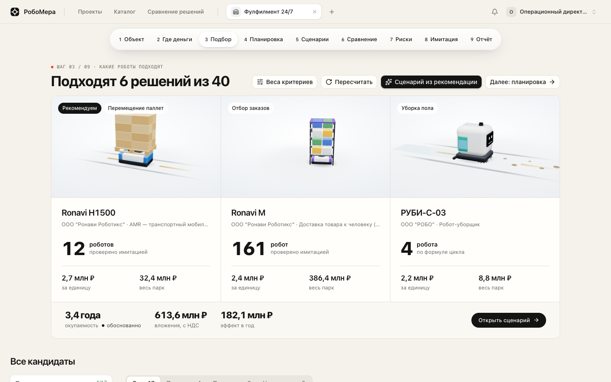
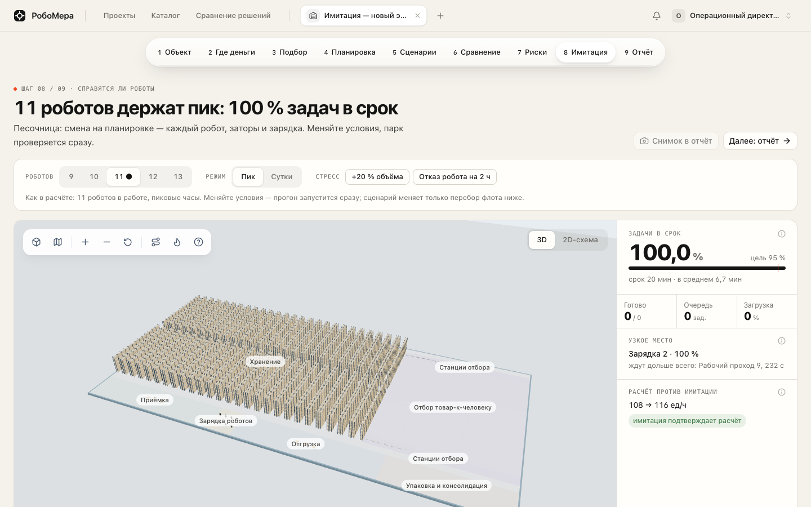
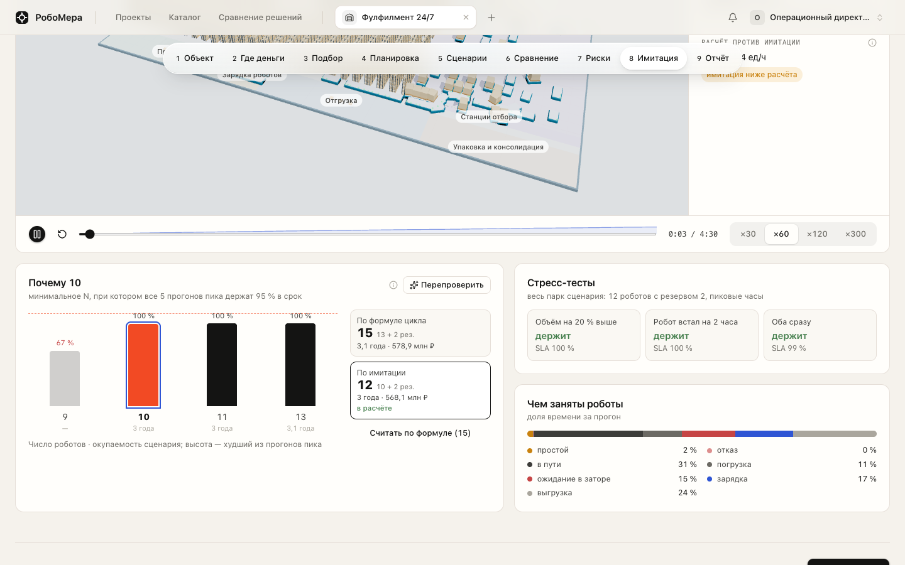
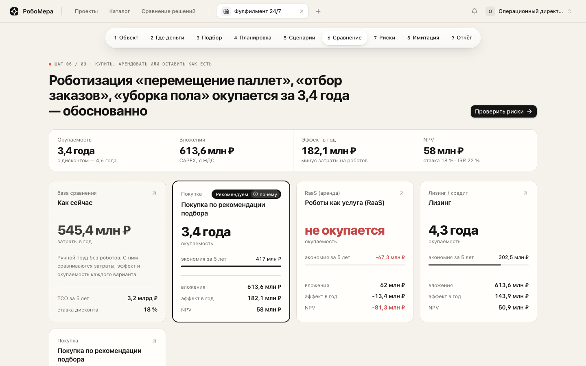
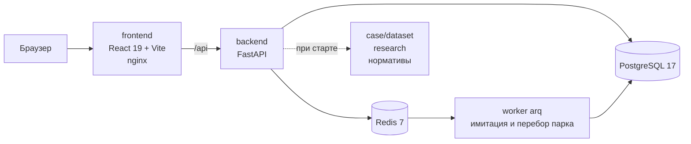

<div align="center">

# РобоМера

### Стоит ли роботизировать ваш объект

**Каталог роботов → объяснимый подбор → сколько нужно → сколько стоит → имитация на плане объекта → отчёт**

[](https://prooood.ru/)
[](https://prooood.ru/api/docs)


Задача 1 ЛЦТ 2026 от ДПиИР Москвы и АНО ФЦ БАС<br>
Платформа подбора роботизированных решений с расчётом экономического эффекта и визуализацией работы роботов на объекте

**[prooood.ru](https://prooood.ru/)** · [Как запустить](#как-запустить) · [Методика](docs/METHOD.md) · [API](docs/api)

</div>

<p align="center">
  
</p>

> [!IMPORTANT]
> Число роботов у нас не берётся из формулы на веру. Формула даёт стартовое число, потом имитация прогоняет пиковые часы на плане объекта для разного размера парка и находит минимальный, который держит сроки во всех прогонах. Это число идёт в экономику, а пользователь видит оба варианта и выбирает сам.

## Зачем это нужно

Директор склада, больницы или аэропорта хочет понять стоит ли вообще связываться с роботами. Обычно на это уходят недели переписки с интеграторами. В РобоМере он заводит объект и за несколько минут получает ответ крупно, а доказательство рядом.

| Вопрос | Что отвечает РобоМера |
|---|---|
| Какие роботы подходят именно мне | Подбор по каждому процессу объекта с причинами почему подходит или нет, в цифрах |
| Сколько их нужно | Расчёт по циклу с резервом и проверка имитацией на плане объекта |
| Сколько стоит и когда окупится | CAPEX, OPEX, эффект, окупаемость, NPV, IRR, TCO. Покупка, RaaS и лизинг рядом |
| Можно ли верить | Каждое число раскрывается до исходных значений и источника, допущения помечены |
| А если объём вырастет или робот сломается | Стресс-тесты в имитации, чувствительность и Монте-Карло |
| Что показать руководству | PDF и Excel отчёт со снимками имитации, допущениями и списком что уточнить |

## Как запустить

Нужен только Docker с Docker Compose. Больше ничего ставить не надо, всё собирается в контейнерах. Проверяли на чистом клоне с пустой базой.

```bash
git clone https://github.com/luhgeek1/robosim-studio-hack.git
cd robosim-studio-hack
docker compose up -d --build
```

Первая сборка идёт несколько минут. Потом открываются

| Что | Где |
|---|---|
| Интерфейс | http://localhost:3000 |
| Документация API (Swagger) | http://localhost:8000/api/docs |

База, миграции, справочники, каталог организатора и демо-учётки создаются сами при первом старте, руками ничего делать не нужно.

Остановить можно командой `docker compose down`, стереть все данные и начать с нуля `docker compose down -v`. Если порты 3000, 8000, 5432 или 6379 заняты, поменяйте левую часть в ports в docker-compose.yml.

Задеплоенная версия всегда открыта на **[prooood.ru](https://prooood.ru/)**, там всё то же самое.

## Демо-доступ

Ничего вводить не нужно. На странице входа внизу блок **Демо-доступ для жюри**, там три кнопки, нажали и вы внутри под нужной ролью.

| Кнопка | Учётка | Что можно |
|---|---|---|
| Пользователь | user@robomera.demo | проекты, подбор, сценарии, имитация, отчёты |
| Администратор | admin@robomera.demo | каталог, нормативы с версиями, справочники, импорт каталога, пользователи |
| Производитель | vendor@robomera.demo | свои карточки, заявки на правки, как продукты проходят подбор, ответы на запросы КП |

Пароль у всех Demo12345! если захочется войти руками. Каталог решений открыт и без входа.

## Что посмотреть за 5 минут

1. Войти как **Пользователь** и создать проект из демо-объекта **Склад 20 000 м², 180 сотрудников**. Это данные организатора, планировка построится сама.
2. **Подбор**. Кандидаты по каждому процессу с причинами. Кнопка **Сценарий из рекомендации** собирает сценарий, считает деньги и сразу проверяет число роботов имитацией.
3. **Сценарии**. Откуда взялось число роботов, по формуле и по имитации, с окупаемостью каждого.
4. **Сравнение**. Как сейчас, покупка, RaaS, лизинг.
5. **Риски**. Что будет если объём, зарплаты или цены уедут.
6. **Имитация**. Смена на плане склада в 2D и 3D, заторы, зарядка, стресс-тесты.
7. **Отчёт**. PDF и Excel.

Потом стоит открыть второй демо-склад **Фулфилмент 24/7**. Это тот же склад организатора в три смены, и там окупаются сразу три типа роботов: паллетные AMR, товар к человеку и уборка. Видно как разные роботы работают на одной карте. Параметры которые мы поменяли помечены как допущения команды.

Для **больницы** и **аэропорта** есть свои демо-объекты из датасета организатора. Там своя планировка (этаж больницы с лифтами, зал сортировки багажа и перрон) и тоже работает имитация.

## Результаты на данных организатора

| Демо-объект | Решение | Роботов | CAPEX | Окупаемость | NPV за 5 лет |
|---|---|---|---|---|---|
| Склад, по формуле | AMR на перемещение паллет | 14 + 3 резерв | 50,2 млн ₽ | 3,0 года | +10,7 млн ₽ |
| Склад, по имитации | тот же AMR | **11 + 2 резерв** | **40,3 млн ₽** | **2,2 года** | **+25,3 млн ₽** |
| Фулфилмент 24/7 | AMR + товар к человеку + уборка | 177 | 613,6 млн ₽ | 3,4 года | +58 млн ₽ |

Имитация тут дала меньше роботов чем формула, потому что робот берёт ближайшую задачу вместо пустого возврата и работает без запаса на загрузку. Бывает и наоборот, когда мешают заторы или станции, это тоже видно на экране.

<p align="center">
  
</p>

<p align="center">
  
</p>

## Что умеет

**Каталог.** Таблица организатора с иерархией отрасль → тип объекта → процесс → тип решения → продукт. Группы характеристик, поиск, фильтры, сравнение. У каждой характеристики источник и дата, пустые поля видны. Админ обновляет каталог из файла с предпросмотром или правит руками.

**Объект.** Склад, больница или аэропорт. Параметры из датасета, из шаблона, копией или импортом, у каждого поля единицы и подсказки. Проверки на противоречия.

**Подбор.** Жёсткие ограничения отсекают (проход, грузоподъёмность, высота, температура), остальное ранжируется по весам которые можно поменять. Решение которое не окупается за 7 лет не может обогнать окупаемое. Недостающие характеристики дают статус требует проверки, а не молчаливое исключение.

**Количество и экономика.** Цикл робота из маршрутов планировки, доступность, целевая загрузка, резерв. CAPEX с инфраструктурой и интеграцией, OPEX, высвобождаемые ставки с взносами, окупаемость простая и дисконтированная, NPV, IRR, ROI, TCO. Покупка, RaaS, лизинг. Вердикт по порогам 3, 5 и 7 лет.

**Планировка.** Генерируется из параметров объекта: зоны, стеллажи, ворота, зарядки, граф проездов. Средние маршруты с неё идут в расчёт цикла.

**Имитация.** Дискретно-событийная модель на графе проездов: каждый робот, очереди, заторы в узких проходах, зарядка, станции, лифты в больнице. Перебор парка по 5 прогонов пика на каждое число, стресс-тесты, тепловая карта заторов, 2D и 3D, плеер со скоростью.

**Риски.** Чувствительность по драйверам и Монте-Карло.

**Отчёт.** PDF и Excel с расчётом, допущениями, источниками, снимками имитации и списком что уточнить при обследовании.

**Роли.** Гость, пользователь, администратор, производитель. Организации с общими проектами и приглашениями. Производитель видит как его продукты проходят подбор и отвечает на запросы КП, цена из КП одной кнопкой идёт в расчёт.

<p align="center">
  
</p>

## Почему так решили

| Решение | Почему |
|---|---|
| В коде нет чисел без источника | ТЗ требует обоснованных коэффициентов. Все 145 нормативов лежат в реестре с источником или обоснованием, 92 из них честно помечены как допущения команды. Админ меняет их и выпускает версию, старые расчёты помечаются устаревшими |
| Имитация участвует в расчёте, а не рисует картинку | Перебор парка записывает число роботов в сценарий и экономика пересчитывается. Пользователь видит и формулу, и имитацию и выбирает сам |
| Парк принят только если держит все 5 прогонов пика | По среднему проходил парк у которого один день из пяти сильно проваливался. Нам важно чтобы склад не вставал в плохой день |
| LLM ничего не считает | Подбор, количество, экономика и имитация это детерминированный код с тестами. Так результат повторяется и объясняется |
| Глубина на складе, но больница и аэропорт тоже работают | Организаторы советовали вложиться в один объект глубоко. Склад проработан полностью, для больницы и аэропорта своя планировка и имитация доставки и багажа, уборка и сервис по формуле |
| Всё в Docker Compose | Жюри запускает одной командой, внешние сервисы не нужны, все данные для демо лежат в репозитории |

Подробнее про методику в **[docs/METHOD.md](docs/METHOD.md)**.

## Как устроено



| Папка | Что внутри |
|---|---|
| backend | API и расчётное ядро: подбор, количество, экономика, планировка, имитация на SimPy, отчёты |
| backend/app/seeds/data | нормативы с источниками, типы объектов, процессы и формулы |
| frontend | веб-клиент, 2D и 3D на three.js |
| docs/api | OpenAPI контракт, по нему в тестах проверяется каждый ответ API |
| case/dataset | датасеты организатора, бэкенд читает их при первом старте |
| research | источники характеристик роботов и сценарии ФЦ БАС |

Бэкенд покрыт тестами (больше 360, идут на настоящих Postgres и Redis). Расчёт сценария занимает десятки миллисекунд при лимите ТЗ 10 секунд, имитация смены меньше секунды, перебор парка несколько секунд.

<div align="center">

**Команда Чупапис** · ЛЦТ 2026

</div>
